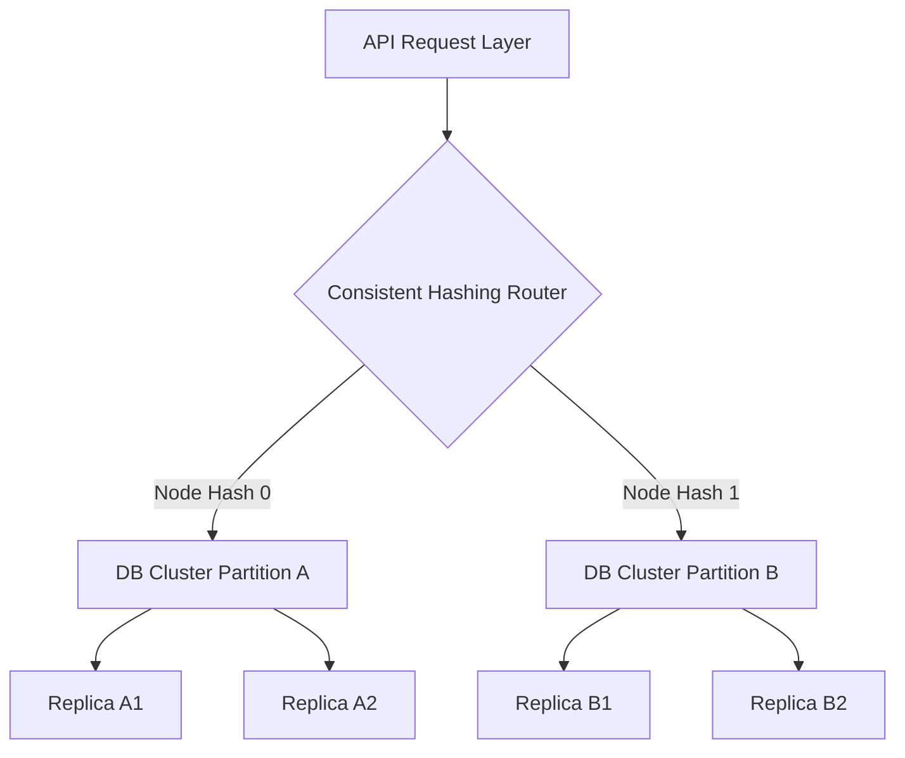

# Sharding Strategies for High-Throughput Databases
An exploration into distributed data segmentation.

## Base Sharding Topology


## Core Concepts

### Consistent Hashing
Consistent hashing is the backbone of modern sharding. Instead of naive modulo hashing, which breaks on node addition/removal, consistent hashing maps both data and nodes to a ring. When a node joins or leaves, only ~1/n of the data needs rebalancing.

**Why it matters:**
- Minimal data movement during scaling
- Predictable shard location for any key
- Production systems: DynamoDB, Cassandra, Redis Cluster

### Shard Key Selection
The shard key determines which partition receives data. Poor choices create hotspots.

**Good shard keys:**
- User ID (naturally distributes load across users)
- Tenant ID (SaaS multi-tenancy)
- Geographic region (EU vs US data placement)

**Bad shard keys:**
- Timestamp (all new data → single shard)
- Boolean flags (binary split, poor distribution)
- Status enums (creates severe hotspots)

## Production Code Examples

### Python Consistent Hash Router
```python
import hashlib
from bisect import bisect_right

class ConsistentHashRing:
    def __init__(self, nodes=None, replicas=3):
        self.nodes = set(nodes or [])
        self.replicas = replicas
        self.ring = {}
        self._rebuild_ring()
    
    def _hash(self, key):
        """Generate hash value for key."""
        return int(hashlib.md5(str(key).encode()).hexdigest(), 16)
    
    def _rebuild_ring(self):
        """Rebuild the hash ring after node changes."""
        self.ring = {}
        for node in self.nodes:
            for i in range(self.replicas):
                virtual_key = f"{node}:{i}"
                hash_value = self._hash(virtual_key)
                self.ring[hash_value] = node
    
    def add_node(self, node):
        """Add a node and rebalance."""
        self.nodes.add(node)
        self._rebuild_ring()
        return self._get_rebalance_operations(node)
    
    def remove_node(self, node):
        """Remove a node and rebalance."""
        self.nodes.discard(node)
        self._rebuild_ring()
    
    def get_node(self, key):
        """Find target node for a key."""
        if not self.ring:
            return None
        
        hash_value = self._hash(key)
        sorted_hashes = sorted(self.ring.keys())
        
        # Find first hash >= our key hash
        idx = bisect_right(sorted_hashes, hash_value)
        if idx == len(sorted_hashes):
            idx = 0
        
        return self.ring[sorted_hashes[idx]]
    
    def _get_rebalance_operations(self, new_node):
        """Calculate migration plan for new node."""
        operations = []
        hash_value = self._hash(f"{new_node}:0")
        # Migration logic would go here
        return operations

# Usage
ring = ConsistentHashRing(nodes=['shard-0', 'shard-1', 'shard-2'])
user_id = 'user:12345'
target_shard = ring.get_node(user_id)
print(f"Route {user_id} to {target_shard}")
```

### Range-Based Sharding (Alternative)
```python
class RangeShardRouter:
    """For scenarios where consistent hashing isn't ideal."""
    
    def __init__(self, shard_ranges):
        # shard_ranges: [(0, 1000, 'shard-0'), (1001, 2000, 'shard-1'), ...]
        self.ranges = sorted(shard_ranges, key=lambda x: x[0])
    
    def get_shard(self, user_id):
        """O(log n) lookup with binary search."""
        for start, end, shard in self.ranges:
            if start <= user_id <= end:
                return shard
        raise ValueError(f"No shard for {user_id}")
    
    def add_shard(self, start, end, shard):
        """Add new range-based shard."""
        # Requires re-splitting existing ranges
        # More expensive than consistent hashing during scaling
        self.ranges.append((start, end, shard))
        self.ranges.sort()

# Trade-off: simpler but requires planned splitting
```

## Failure Modes & Scaling

### Problem 1: Uneven Distribution (Hotspots)
**Symptom:** One shard has 10x the load of others
**Root Cause:** Poor shard key selection or uneven hash function

**Solution:**
```python
def detect_hotspots(metrics):
    """Alert if shard load variance > 30%."""
    loads = [m['request_count'] for m in metrics]
    avg = sum(loads) / len(loads)
    variance = max(loads) / avg
    
    if variance > 1.3:
        hotspot_shard = max(metrics, key=lambda x: x['request_count'])
        return f"ALERT: {hotspot_shard['shard']} has {variance:.1f}x avg load"
```

### Problem 2: Shard Rebalancing at Scale
**Symptom:** Adding new shard causes 30-second spike in latency
**Root Cause:** Moving terabytes of data synchronously

**Solution: Background Migration**
```python
class ShardMigration:
    def __init__(self, source_shard, dest_shard, ring):
        self.source = source_shard
        self.dest = dest_shard
        self.ring = ring
        self.cursor = 0
        self.batch_size = 1000
    
    def execute_batch(self):
        """Non-blocking migration in batches."""
        batch = self.source.scan(self.cursor, self.batch_size)
        
        for record in batch:
            # Check if record should move to new shard
            new_shard = self.ring.get_node(record['id'])
            if new_shard == self.dest:
                self.dest.put(record)
                self.source.delete(record['id'])
        
        self.cursor += len(batch)
        return len(batch) > 0  # Return True if more work

# Run in background worker
migration = ShardMigration(shard_a, shard_b, ring)
while migration.execute_batch():
    time.sleep(0.1)  # Rate limit to avoid overwhelming cluster
```

### Problem 3: Cross-Shard Queries
**Symptom:** "Get all users in Texas" requires querying all 100 shards
**Solution:** Denormalization or secondary indices

```python
class ShardedQuery:
    def __init__(self, shards):
        self.shards = shards
    
    def scatter_gather(self, query, shard_keys=None):
        """Query all shards, gather results."""
        if shard_keys:
            # Targeted query to specific shards
            targets = [self.shards[key] for key in shard_keys]
        else:
            # Broadcast to all shards
            targets = self.shards.values()
        
        results = {}
        for shard_id, shard in targets:
            results[shard_id] = shard.execute(query)
        
        # Merge and deduplicate
        return self._merge_results(results)
```

## Scaling Checklist

- [ ] Shard key is naturally distributed (not time-based, status, or geographic without multi-region)
- [ ] Hash function produces uniform distribution (test with sample data)
- [ ] Monitoring: track shard size, request rate, and latency per shard
- [ ] Migration tool tested for your DB type
- [ ] Read replicas configured for each shard
- [ ] Rollback plan if a shard fails during rebalancing
- [ ] Query router handles shard-not-found gracefully
- [ ] TTL or archival policy to prevent shards from growing unbounded